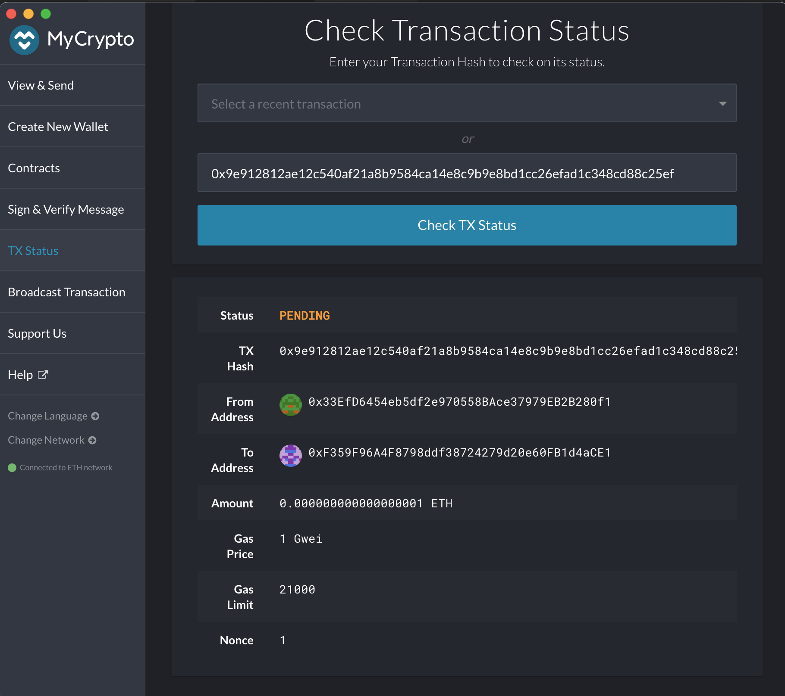
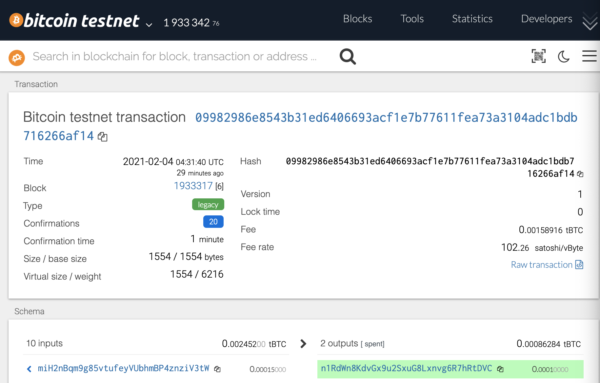

#
# Crypto Wallet

Source: [Pixabay](https://pixabay.com/photos/cryptocurrency-business-finance-3085139/#)
#

The repo describes a process of deriving private and public crypto keys that  will be used to get public addresses which are needed to initiate crypto transactions on a local blockchain.

This process is broken down in several main steps:

* [Create private and public keys using hd-wallet-derive](#create-private-and-public-keys-using-hd-wallet-derive). 

* [Create a local Proof of Work blockchain](#create-a-local-proof-of-work-blockchain).

* [Create a ETH transaction](#create-a-eth-transaction). 

* [Create a BTC-test transaction](#create-a-btc-test-transaction).

* [Create a multi-crypto 
wallet](#create-a-multi-crypto-wallet). 

#
## Create private and public keys using hd-wallet-derive

hd-wallet-derive is a command-line tool that derives bip32 addresses and private keys for Bitcoin and many altcoins. Derivation reports show privkey (wif encoded), xprv, xpub, and address. Source: [hd-wallet-derive](https://github.com/dan-da/hd-wallet-derive)

* First we install the tool by cloning the hd-derive-repo, installing Hypertext Preprocessor [PHP](https://www.php.net/manual/en/intro-whatis.php), and [Composer](https://getcomposer.org/), dependency manager for PHP.

* Next, we run a command line from hd-wallet-derive to derive private and public keys for BTC-test and ETH accounts. We use f" string to pass our mnemonic phrase from .env file and coin code from [constants.py](https://github.com/dbogatic/crypto_wallet/blob/main/constants.py) file into the command. 

    ` command = f" ./derive -g  --mnemonic='{mnemonic_phrase}' --coin='{which_coin}' --numderive=3  --cols=path,address,privkey,pubkey --format=json " `

* The command will return our keys depending on the crypto we selected (which-coin) in [wallet_multi.py](https://github.com/dbogatic/crypto_wallet/blob/main/wallet_multi.py) python file. 

* We select keys we will use and put them in .env or keystore folder to hide them from public.

* We can see derived keys in [keys.ipynb](https://github.com/dbogatic/crypto_wallet/blob/main/keys.ipynb) notebook.
#
## Create a local Proof of Work blockchain

We use Blockchain-Tools and [geth](https://geth.ethereum.org/) to create a local "bogicash' PoW blockchain which we will use to facilitate crypto transactions. 

* For step by step description how to create a local blockchain with geth see this [PoA blockchain](https://github.com/dbogatic/poa_blockchain) repository.

* We assign two accounts we obtained using private keys through hd-derive (we used first two keys for BTC-test and ETH).

#
## Create a ETH transaction

The next step is to create a ETH transaction by using Ethereum [Web3](https://web3js.readthedocs.io/en/v1.3.0/) library. Please refer to [eth_trans.py](https://github.com/dbogatic/crypto_wallet/blob/main/eth_trans.py) file for details.

* First we obtain private keys from .env file to get sender and receiver addresses. 
* Next, we create a raw and send transactions by passing the required parameters.
* Finally, we send a transaction and obtain a confirmation.

* We can see the matching TX Hash on MyCrypto and the blockchain.
#
## Create a BTC-test transaction

The following step is to create BTC-test transaction using a python [bit](https://pypi.org/project/bit/) library. Please refer to [btc_trans.py](https://github.com/dbogatic/crypto_wallet/blob/main/btc_trans.py) for details. 

* Again, the first step is to obtain private keys we created with hd-wallet-derive so we can get addresses for the sender and receiver.

* Then, we obtain sender account balance and unspent transactions. 
* Next, we input the address of the recipient where we will send bitcoin.
* Finally, we create a transaction, send it and obtain a confirmation on the blockchain and Bitcoin Testnet. 

* We can see the matching TX Hash for blockchain and Bitcoin Testnet conffirmations.

#
## Create a multi-crypto wallet

The final step is to join hd-wallet-derive private key derivation tool, ETH transaction and BTC-test transaction into one automated wallet that will derive keys for the specified crypto (in our case BTC-test, BTC or ETH) and execute prepared transactions based on the provided recipients' addresses and amounts as well as return transaction confirmations. For details please see [wallet-multi.py](https://github.com/dbogatic/crypto_wallet/blob/main/wallet_multi.py).

* In order to accomplish this, we have created input user prompts that ask forst for a crypto to be specified.
* Next, if ETH was specified, it creates ETH private keys, obtains account information, sends a transaction and returns a confirmation.
* In case that BTC-test was specified, our file prompts the user for the recipients address, obtains the sender account information, sends a transaction and returns a confirmation.
* Please notice that private keys are manually selected after being derived and placed in .env file to be hidden from the public.
* The final automation of crypto transactions was accomplished by importing our [btc_trans.py](https://github.com/dbogatic/crypto_wallet/blob/main/btc_trans.py) and [eth_trans.py](https://github.com/dbogatic/crypto_wallet/blob/main/eth_trans.py) python files through an if statement, after determining which crypto was selected by the user.
#
© 2021 Author: Dragan Bogatic

